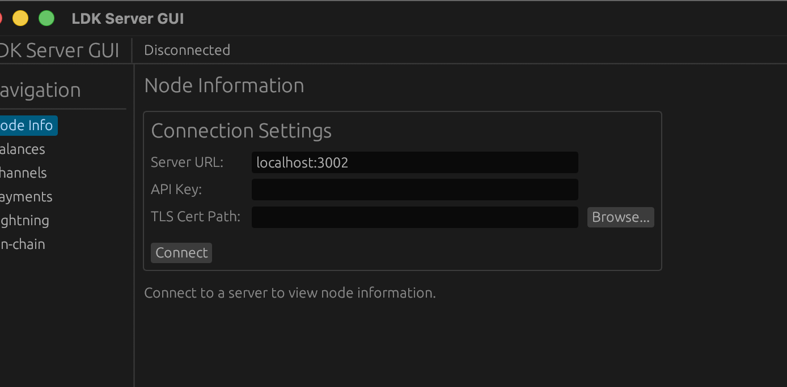
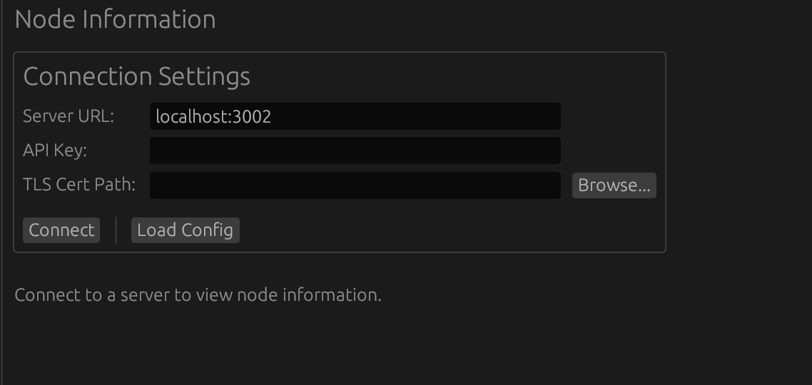
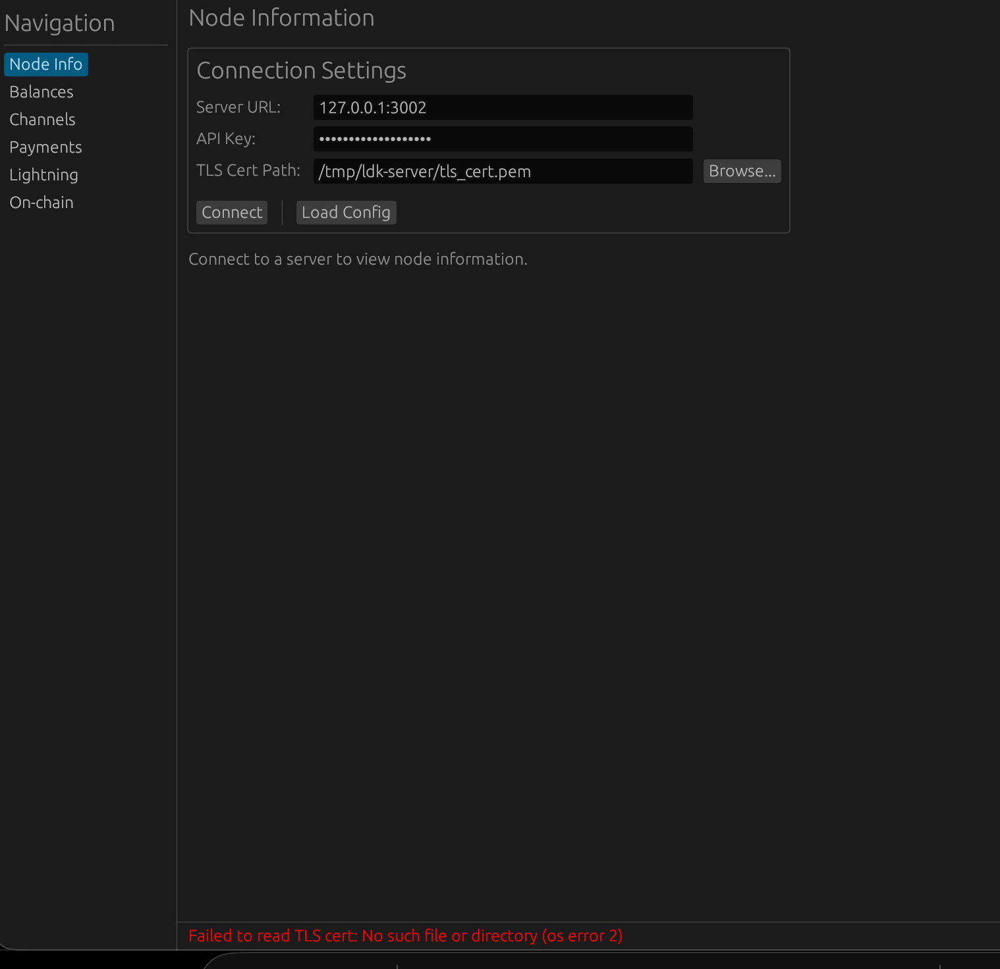

# LDK Server GUI

A graphical user interface for interacting with ldk-server, built with [egui](https://github.com/emilk/egui).

## Screenshots

### Node Info (Connected)


### Balances


### Lightning Payments


### Connection Settings (Disconnected)


### Connection Settings


### Connection Error


## Prerequisites

**Important:** You must start ldk-server before launching the GUI.

The server generates the TLS certificate on first startup, which is required for the GUI to connect.

```bash
# 1. First, start the ldk-server
cargo run -p ldk-server -- --config /path/to/ldk-server-config.toml

# 2. Wait for the server to start and generate the TLS certificate
#    You should see output indicating the server is listening

# 3. Then start the GUI (in a separate terminal)
cargo run -p ldk-server-gui
```

## Building

```bash
cargo build -p ldk-server-gui --release
```

## Running

```bash
cargo run -p ldk-server-gui
```

Or run the release binary directly:

```bash
./target/release/ldk-server-gui
```

## Configuration

### Auto-loading from Config File

The GUI automatically searches for `ldk-server-config.toml` in these locations:
- Current directory
- `../ldk-server/` directory
- Parent directory
- Path specified in `LDK_SERVER_CONFIG` environment variable

When found, the connection settings are auto-populated from the config file, including the auto-generated API key.

You can also click **Load Config** to manually browse for a config file.

### Manual Configuration

If no config file is found, configure the connection manually in the **Node Info** tab:

| Field | Description | Example |
|-------|-------------|---------|
| Server URL | The ldk-server REST API address (without `https://`) | `localhost:3002` |
| API Key | Hex-encoded API key (see below) | `4181fc9f...` |
| TLS Cert Path | Path to the server's TLS certificate | `/tmp/ldk-server/tls.crt` |

**Note on API Key:** The server auto-generates a random API key on first startup and stores it at `<storage_dir>/<network>/api_key`. To get the hex-encoded key manually:
```bash
xxd -p /tmp/ldk-server/regtest/api_key | tr -d '\n'
```

The TLS certificate is also auto-generated and located at `<storage_dir>/tls.crt`.

Click **Connect** to establish a connection.

## Features

- **Node Info** - View node ID, block height, sync timestamps, and chain source info
- **Balances** - View on-chain and lightning balances
- **Channels** - List, open, close, force-close, splice, and update channel config
- **Payments** - View payment history with pagination
- **Lightning** - Send and receive via BOLT11 invoices and BOLT12 offers
- **On-chain** - Send and receive on-chain transactions

